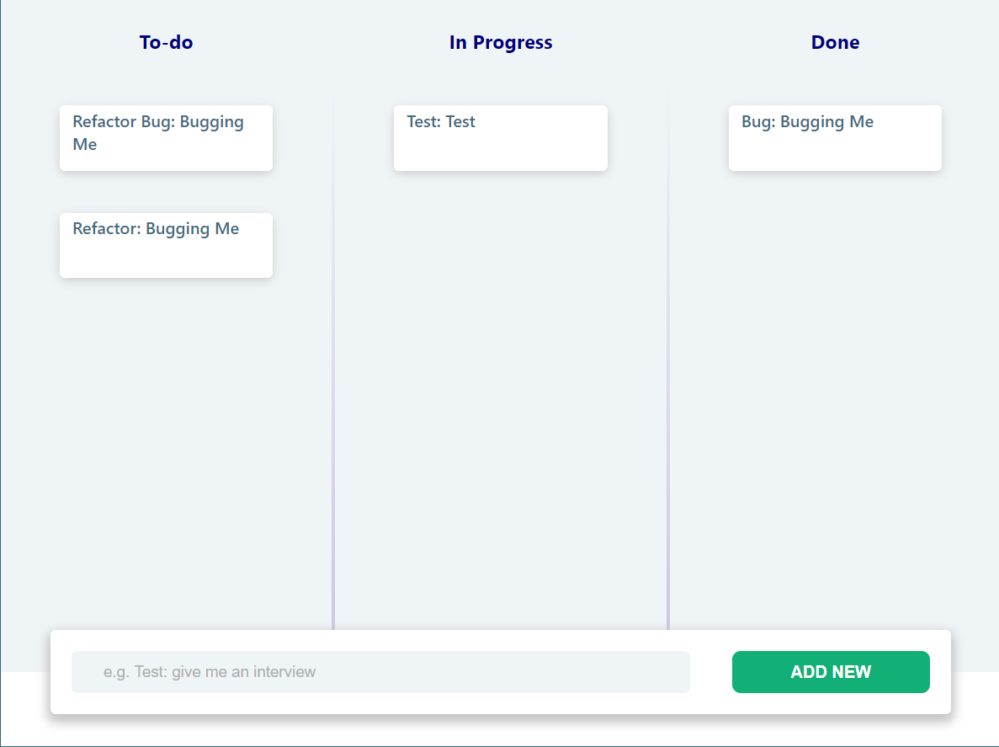
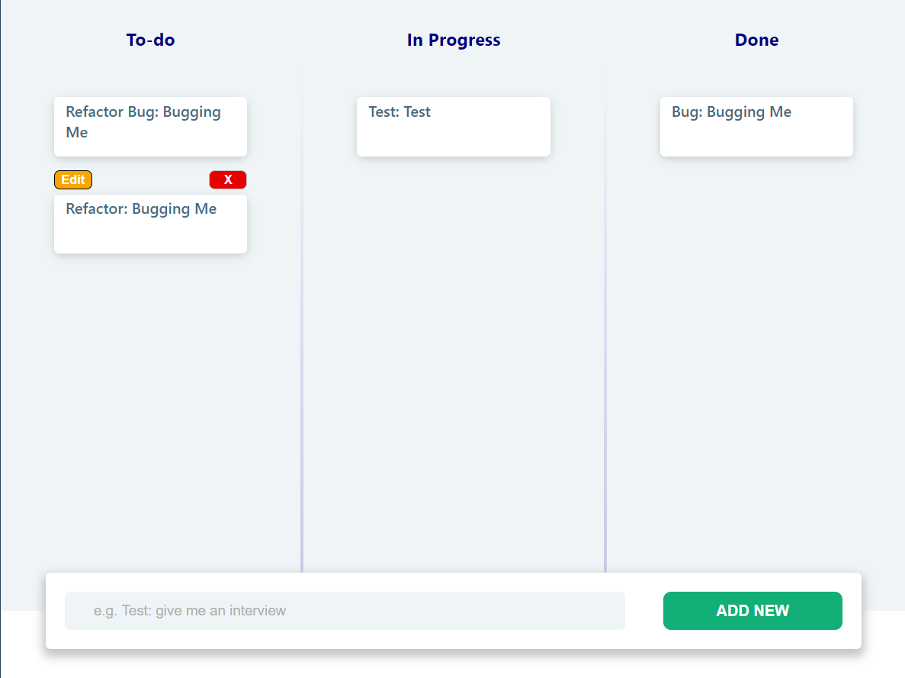
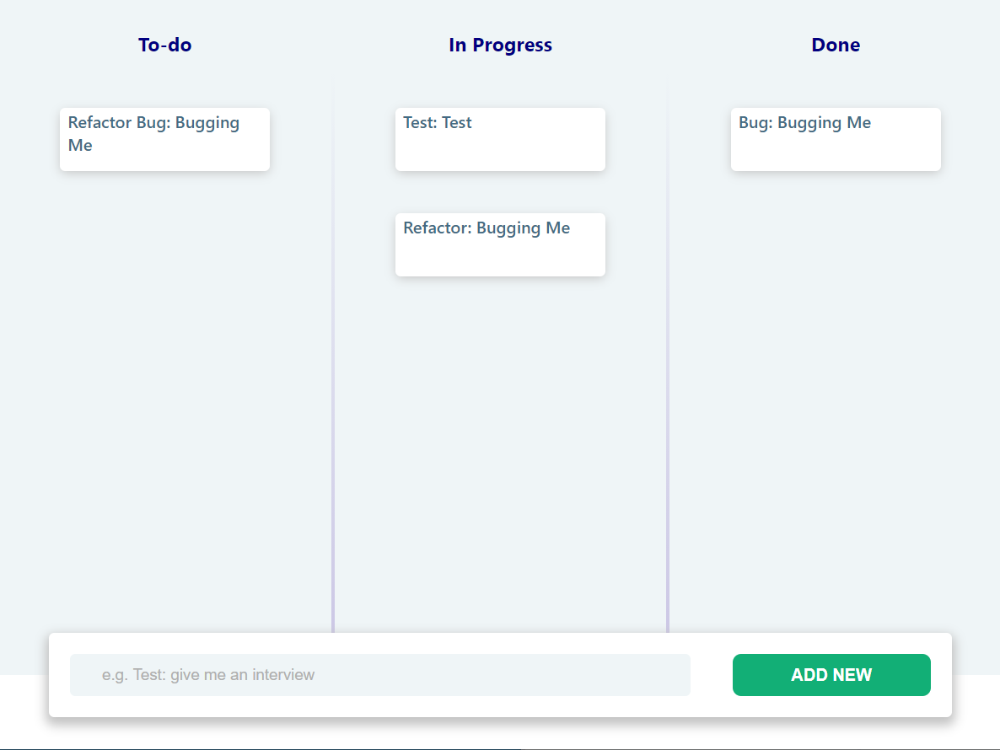
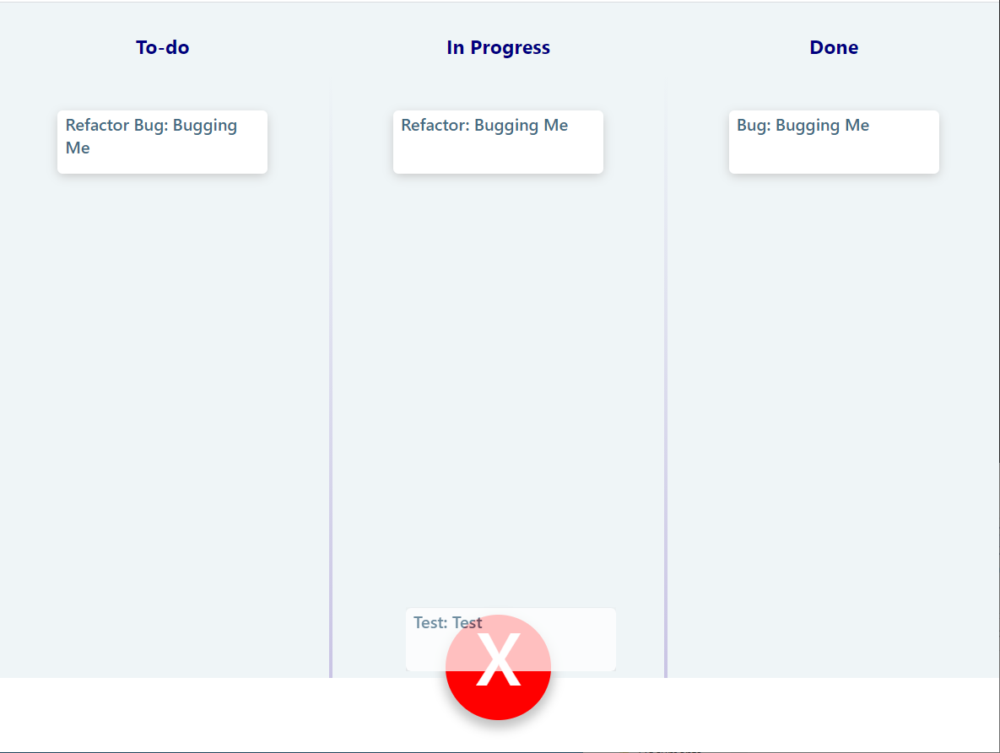
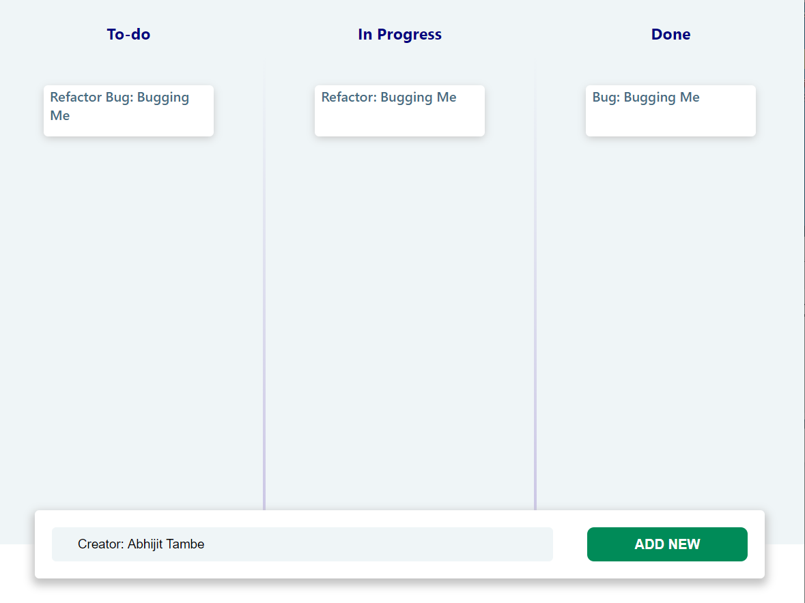
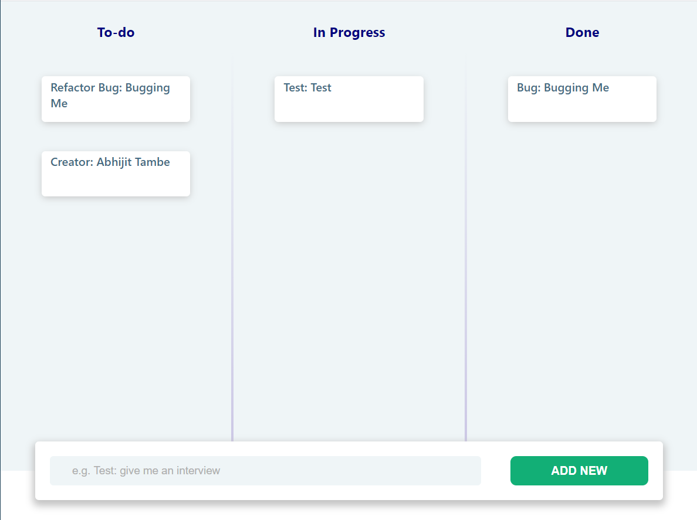
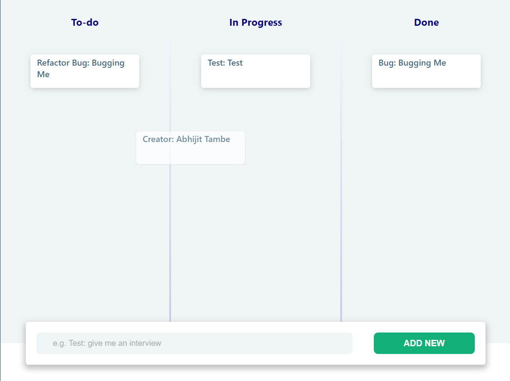
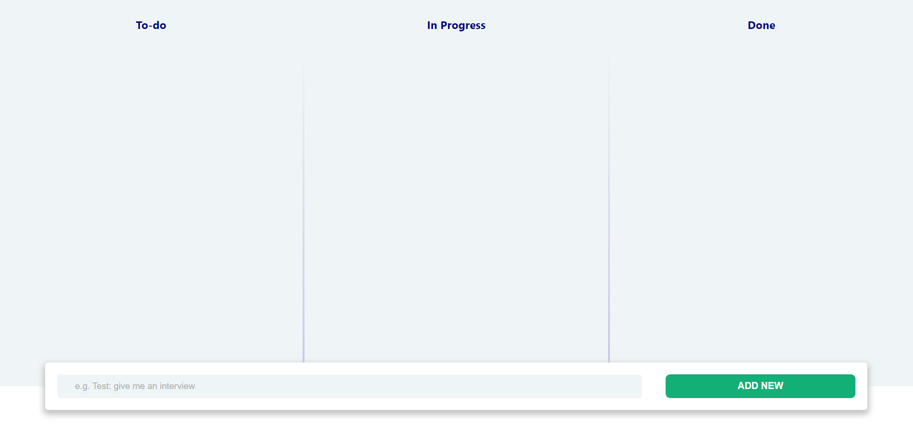

# KanbanDB App

## Pre-interview Assignment Instructions

### Greetings!

Hello potential future team member! :D

We're looking forward to having some great days working on creating new projects, debugging issues, planning applications, solving problems, and all of the other fun things we do here in - together with you!

But before that, let's see if you can demonstrate some stock skills you'll need to be successful in this position. 😁 We will discuss this code with you during the hiring process, and it will be tremendously helpful for us in evaluating your skills.

Note: If anything isn't specifically called out here, feel free to be as inventive as you like. No pressure to adhere to any strict rules. Our primary goal is to know that you generally understand web application principles.

Have fun!

### Task

Create a Kanban Board application in React using this template, which is itself based on a `create-react-app` default template, that meets the below criteria. We have provided a mockup and will evaluate your ability to match this design to the best of your ability, as is feasible. A front-end developer on our team will be expected to be passionate about the visual design as well as efficient implementation.

You can find instructions and source code for `KanbanDB` [here on Github](https://github.com/netpoetica/KanbanDB#kanbandb). This is a "fake" database that uses local storage to emulate something like an [ORM](https://en.wikipedia.org/wiki/Object-relational_mapping), which you can use to perform CRUD operations on Kanban tasks.

* Fork this repo on Github
* There should be three columns with headers: Todo, In Progress, and Done
* Use KanbanDB to perform all "database" operations (KanbanDB is a fake database that uses localStorage, but emulates asynchronocity of a real client, like Firebase)
* Cards should have a title/name, a description, and a status
* The user should be able to change the status of a card between Todo, In Progress, and Done, and changing the status should cause them to render in their respective columns (i.e. all cards with `TODO` status should be in column with Todo header)
* There should be an Add button that lets you add a new card to the board. Whichever status is chosen, it should show up on that board.
* Each card should have a delete button which deletes just that card

BONUS: A card can be edited and saved (`.updateCard()`).

Note: This project was bootstrapped with [Create React App](https://github.com/facebook/create-react-app).

### Task completed

Author: Abhijit Tambe

Email: abhijit.tambe@hotmail.com

Note: This application is not using any 3rd party modules like dnd, redux, redux-thunk. Its basic pure react application managing application state in main Board class component and passing necessary functions and states to other components by prop drilling.

