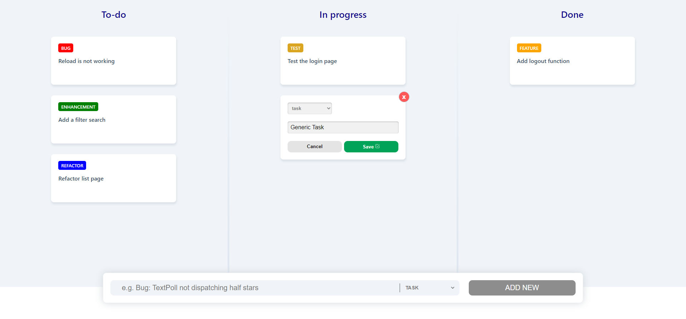

# Kanban App Solution by Sharlon Balbalosa

## Screenshot

## Test coverage

### Hi!

This is my solution for the Kanban App challenge.  I enjoyed building this application although it is not perfect I was able to complete the required and bonus task for this challenge below are the details regarding the technology stack, folder structure and missing items.

### Instructions on how to run
* yarn install
* yarn start
* yarn test (optional)

### Implemented functionality

* Add new task with a name, description.
* Moving a task by drag & drop (status change).
* Reorder of cards (persist order in DB).
* Update name, description card
* Components are unit tested (e.g xxxx.unit.test.tsx).
* Integration test is provided (App.int.test.tsx);

### Folder structure

* src/components - generic components
* src/features - components connected with redux and reducer
* src/services - KanbanDB api wrapper
* types - Types for TypeScript

### Technology stack used

* TypeScript (I love working with TS)
* Jest & React Testing Library for Unit and Integration Test.
* React Beautiful DND for drag and drop
* SASS for styling
* @redux/toolkit for opinionated redux setup

### For improvement(Not Implemented)

* End to end testing using Cypress.
* End to end test for moving a task from one board to another.
* Accessibility

I would love to have your feedback regarding the solution. If you have question or if for some reason the app doesn't run please let me know. (sbalbalosa@gmail.com)

Thanks,
Sharlon Balbalosa
